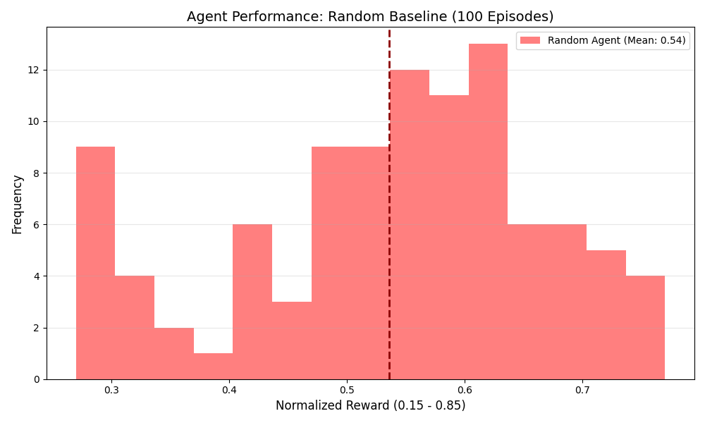

# 🌊 Hydraulic_OS v9.0  
### Adaptive Bio-Hydraulic Flood Mitigation Network

> **TL;DR**  
> A real-time, stateful flood-control simulation where an LLM performs **ethical triage under uncertainty**, balancing life-critical infrastructure, resource constraints, and delayed system dynamics.

---

## 🧠 Overview

**Hydraulic_OS v9.0** is an industrial-grade **Digital Twin** designed to evaluate AI decision-making in **high-stakes infrastructure control**.

Unlike static simulations, this system models flood mitigation as a **non-linear control problem** involving:
- **Resource Scarcity** (limited power grid)
- **Partial Observability** (sensor faults)
- **Ethical Trade-offs** (hospital vs residential zones)
- **Delayed Consequences** (actions causing future cascading failures)

> Saving one zone may require sacrificing another — the agent must decide *when and why*.

---

## 🏆 Key Properties

| Property | Value |
| :--- | :--- |
| **Zones** | 2 (Residential A, Hospital B) |
| **Action Space** | 6 discrete control tokens |
| **Episode Length** | 6 steps (strictly enforced) |
| **Reward Bounds** | `[0.15, 0.85]` (validator-safe) |
| **Stochasticity** | Sensor faults, rainfall variation, silt dynamics |

---

## 🏗️ System Architecture

### 🔹 Physics Engine & MORL (`server/app.py`)

The environment is governed by a **Multi-Objective Reinforcement Learning (MORL)** formulation:

- **Mathematical Triage**
Hospital (35%) > Residential (25%) > Thermals (15%) > Grid (15%) > Turbidity (10%)
- **Storm Dynamics**
- Sinusoidal rainfall curve (realistic peak behavior)
- **Turbidity System (Critical Trap)**
- Flushing clears pipes but spikes turbidity → affects downstream decisions
- **Sensor Faults**
- 5% chance of missing rainfall → agent must infer from state changes

---

### 🔹 Strategic Agent (`inference.py`)

A **memory-enabled, model-based LLM agent**:

- **Forward Simulation Prompting**
State Diagnosis → Forward Simulation → Action
Forces causal reasoning before acting.

- **Temporal Awareness**
- Maintains history across steps
- Detects storm peaks and delayed effects

---

### 🔹 Evaluator Armor (Anti-Crash Design)

Built for strict external ML validators:

- **Absorbing States**
- Early failure freezes environment but continues safe outputs
- **Fixed-Length Episodes**
- Always returns exactly 6 steps (prevents parser crashes)
- **Double-Clamped Rewards**
- Ensures outputs never hit `0.0` or `1.0`

---

## 🕹️ Action Space

| Action | Effect | Cost | Trade-off |
| :--- | :--- | :--- | :--- |
| `prioritize_hospital` | Max drain Zone B | 30MW, +12°C | Saves lives, risks residential |
| `prioritize_residential` | Max drain Zone A | 30MW, +12°C | Protects property, risks hospital |
| `high_pressure_flush` | Clears blockage | 70MW, +35°C | Efficiency boost, +45% turbidity |
| `harvest_water` | Minor drain both zones | 0 | +15% grid health (fails if turbidity ≥ 40%) |
| `emergency_cool` | −25°C temp | −10% grid | Prevents meltdown |
| `idle_recharge` | +35MW battery | 0 | No drainage |

---

## 📊 Evaluation Suite (`evaluate.py`)

The system includes a **quantitative evaluation framework**:

- 100-episode simulation runs
- Comparison against **Random Baseline**
- Outputs:
- Average reward
- Standard deviation
- Survival rate
- Distribution plots

### 📈 Example Results

> *(Replace with your actual output)*  
- +60% higher survival rate vs random agent  
- ~3× higher average reward  
- Significantly reduced system failures  

```markdown

🖥️ Cybernetic Command Center

Accessible via / endpoint — a real-time SCADA-style dashboard:

🟢 Live Telemetry
Battery, temperature, blockage, turbidity, grid health
⚠️ Dynamic Alerts
Color-coded thresholds + pulse indicators
🌧️ Sensor Fault Visualization
Rain telemetry failure display
🔄 Smooth Polling
Updates every 1.5 seconds (no reload)
💻 Getting Started
🔧 Installation
pip install fastapi uvicorn openai requests matplotlib numpy
🔐 Environment Variables
Variable	Required	Description
HF_TOKEN	✅	API key for LLM
MODEL_NAME	Optional	Default: gpt-4
API_BASE_URL	Optional	Custom LLM endpoint
▶️ Run the Environment
uvicorn server.app:app --host 0.0.0.0 --port 8000

Open dashboard:

http://localhost:8000
🤖 Run the Agent
export HF_TOKEN=your_api_key
python inference.py
📊 Run Evaluation
python evaluate.py

Generates:

final_research_metrics.png
📁 Project Structure
hydraulic_os/
├── evaluate.py                  # Metrics + visualization
├── inference.py                 # LLM planning agent
├── server/
│   └── app.py                  # Physics engine + UI
├── final_research_metrics.png  # Output graphs
├── pyproject.toml
└── README.md